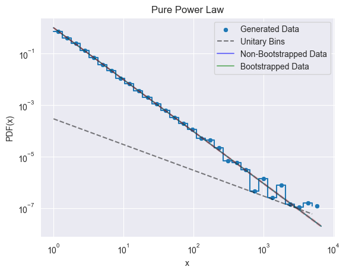
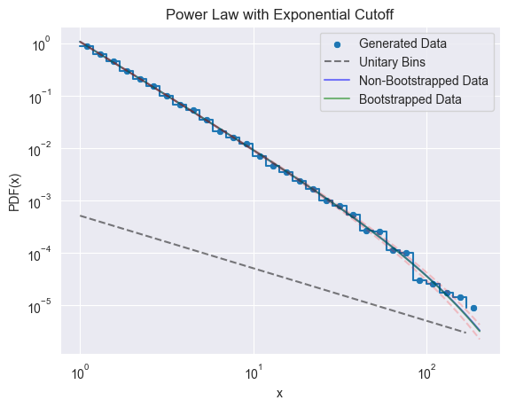
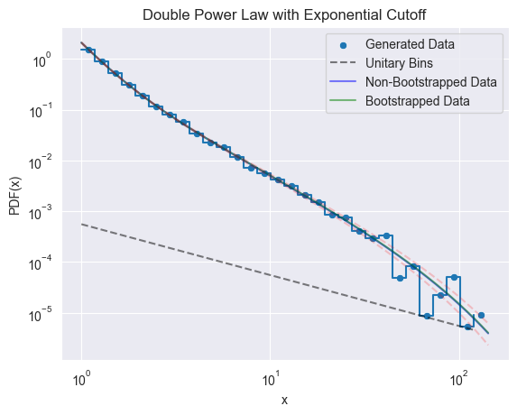
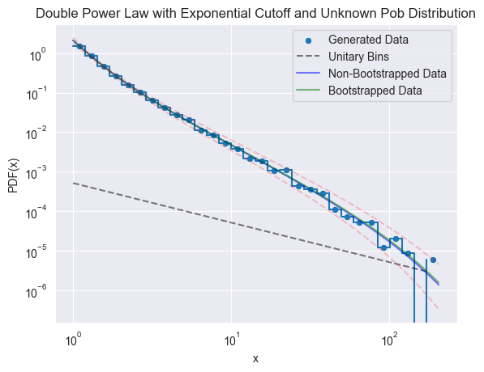

# Optimization-Methods-for-ML-in-Power-Laws

Computation and execution of the optimization methods to retrieve parameters for data that follows different kinds of power laws. 


## Authors

- [Abraham Martínez Cuesta](https://amprod18.github.io)

With the supervision and guidance of:
- [Jordi Baró i Urbea](https://web.ub.edu/en/web/directori/home?accio=SEL&id=sg69w0k3wi6iv72r&lang=en)

## Contents

- [Documentation](#documentation)
- [Features](#features)
- [Demos](#demos)
- [Next Steps](#roadmap-and-next-steps)
- [Licenses](#licenses)
- [Acknowledgements](#acknowledgements)

## Documentation

TBD


## Features

- Probability Density Funtions:
    - Pure Power Law
    - Power Law with Exponential Cutoff
    - Double Power Law with Exponential Cutoff
- Cumulative Probability Density Funtions:
    - Pure Power Law
    - Power Law with Exponential Cutoff
    - ~~Double Power Law with Exponential Cutoff~~ (TBD)
- Generation Methods:
    - Pure Power Law via Inverse Transformation
    - Power Law with Exponential Cutoff via Accept-Reject Method
    - Double Power Law with Exponential Cutoff via Hybridizing Inverse Transformation and Accept-Reject Methods
- Negative Log Likelihood Funtions:
    - Pure Power Law
    - Power Law with Exponential Cutoff
    - Double Power Law with Exponential Cutoff
    - Double Power Law with Exponential Cutoff and Unknown Population Distribution
- Hessian Funtions:
    - Pure Power Law
    - Power Law with Exponential Cutoff
    - Double Power Law with Exponential Cutoff
    - Double Power Law with Exponential Cutoff and Unknown Population Distribution
- Maximum Likelihood Estimation:
    - Pure Power Law
- Optimization Methods:
    - Nelder-Mead via scipy.optimize
    - SLSQP via scipy.optimize
    - ~~Gradient Descend~~ (Not working ATM)
- Plot of the results:
    - Minimization via Desired Optimization Method and Standard Error via Hessian and Fischer Information Matrix
    - Minimization via Desired Optimization Method and Standard Error via Bootstrapping the Sample
    - Comparison of the Results Obtained via Hessian and Bootstrap
- Statistical Toolkit:
    - Function to Bootstrap a Sample
    - Bootstrap Standard Error Computation
    - Akaike Information Criterion
    - Bayesian Information Criterion
- Mathematical Toolkit:
    - Upper Incomplete Gamma Function First Derivates
    - Upper Incomplete Gamma Function Second Derivates
    - Upper Incomplete Gamma Function Second Cross Derivates
- Demo Routines with Generation or Custom Input Samples:
    - [Pure Power Law](#pure-power-law)
    - [Power Law with Exponential Cutoff](#power-law-with-exponential-cutoff)
    - [Double Power Law with Exponential Cutoff](#double-power-law-with-exponential-cutoff)
    - [Double Power Law with Exponential Cutoff and Unknown Population Distribution](#double-power-law-with-exponential-cutoff-and-unknown-population-distribution)

## Demos

### Recomended Import of the Library

```python
import Power_Laws_Generator as plg
```

### Pure Power Law

- Generation:
```python
x = plg.analytic_power(n_samples, alpha=alpha2, x_min=x_min)
```

- Bootstrapping:
```python
alpha_pred = np.array([])

for _ in range(bootstrap):
    xb = plg.bootstrap_sample(x)
    alpha_pred = np.append(alpha_pred, plg.power_law_likelihood(xb))

# Alpha
alpha_std_bootstrap = plg.bootstrap_std(alpha_pred, bootstrap)
alpha_pred_bootstrap = np.sum(alpha_pred) / bootstrap
x_estimated = np.linspace(min(x), max(x), len(x))
px_bootstrap = plg.power_pdf(x_estimated, alpha=alpha_pred_bootstrap, x_min=x_min)
```

- Hessian:
```python
alpha_pred = plg.power_law_likelihood(x)
hess = plg.power_hessian(x, alpha_pred)
alpha_std = np.sqrt(1/hess)
px = plg.power_pdf(x_estimated, alpha=alpha_pred, x_min=x_min)
akaike = plg.akaike_information(x, plg.dslope_law_likelihood, (alpha1_pred, alpha2_pred, x_c_pred), x_min=x_min)
bayes = plg.bayesian_information(x, plg.dslope_law_likelihood, (alpha1_pred, alpha2_pred, x_c_pred), x_min=x_min)
```

- Max/Min Errors:
```python
errors_non_bootstrap = np.array([plg.power_pdf(x_estimated, alpha=alpha_pred + (-1)**(i//1) * alpha_std, x_min=x_min) for i in range(2)])
errors_non_bootstrap = np.array([np.max(errors_non_bootstrap, axis=0), np.min(errors_non_bootstrap, axis=0)])

errors_bootstrap = np.array([plg.power_pdf(x_estimated, alpha=alpha_pred_bootstrap + (-1)**(i//1) * alpha_std_bootstrap, x_min=x_min) for i in range(2)])
errors_bootstrap = np.array([np.max(errors_bootstrap, axis=0), np.min(errors_bootstrap, axis=0)])

errors = np.array([errors_non_bootstrap, errors_bootstrap])
```

- Plotting:
```python
print(f'Akaike Information Criteria: {round(akaike, 4)}\tBayesian Information Criteria: {round(bayes, 4)}')
print(f'Non-Bootstrapped Samples:\n\tSlope Predicted: {alpha_pred} +- {alpha_std}')
print(f'\nBootstrapped Samples:\n\tSlope Predicted: {alpha_pred_bootstrap} +- {alpha_std_bootstrap}')

plg.plot_data(x, n_bins, x_estimated, px_bootstrap, px, errors, title='Pure Power Law')
```

- Sample Output:
```
Akaike Information Criteria: 39448.0339	Bayesian Information Criteria: 39455.2439
Non-Bootstrapped Samples:
	Slope Predicted: 1.9873529425075827 +- 0.009873529425075826

Bootstrapped Samples:
	Slope Predicted: 1.9881502055468692 +- 0.0091180713725883
```


### Power Law with Exponential Cutoff

- Generation:
```python
x = plg.accept_reject_damped(n_samples, alpha=alpha2, x_c=x_c, x_min=x_min)
```

- Bootstrapping:
```python
alpha0, x_c0 = alpha2 + np.random.uniform(-1, 1, 1), x_c + np.random.uniform(-10, 10, 1)

alpha_pred = np.array([])
x_c_pred = np.array([])

for _ in range(bootstrap):
    xb = plg.bootstrap_sample(x)
    result = plg.minimize_by_scipy(xb, plg.cutoff_law_likelihood, (alpha0, x_c0))
    alpha_pred = np.append(alpha_pred, result.x[0])
    x_c_pred = np.append(x_c_pred, result.x[1])
# Alpha
alpha_std_bootstrap = plg.bootstrap_std(alpha_pred, bootstrap)
alpha_pred_bootstrap = np.sum(alpha_pred)/bootstrap
# X_c
x_c_std_bootstrap = plg.bootstrap_std(x_c_pred, bootstrap)
x_c_pred_bootstrap = np.sum(x_c_pred)/bootstrap


x_estimated = np.linspace(min(x), max(x), len(x))
px_bootstrap = plg.damped_power_pdf(x_estimated, alpha=alpha_pred_bootstrap, x_c=x_c_pred_bootstrap, x_min=x_min)
```

- Hessian:
```python
result = plg.minimize_by_scipy(x, plg.cutoff_law_likelihood, (alpha0, x_c0))
alpha_pred, x_c_pred = result.x[0], result.x[1]
hess = plg.damped_power_hessian(x, alpha_pred, x_c_pred)
alpha_std, x_c_std = np.diagonal(np.sqrt(np.linalg.inv(hess)))
px = plg.damped_power_pdf(x_estimated, alpha=alpha_pred, x_c=x_c_pred, x_min=x_min)
akaike = plg.akaike_information(x, plg.cutoff_law_likelihood, (alpha_pred, x_c_pred), x_min=x_min)
bayes = plg.bayesian_information(x, plg.cutoff_law_likelihood, (alpha_pred, x_c_pred), x_min=x_min)
```

- Max/Min Errors:
```python
errors_non_bootstrap = []
errors_bootstrap = []
for i in range(4):
    alpha2test = max(1, alpha_pred + (-1)**(i//1)*alpha_std)
    xc2test = max(0, x_c_pred + (-1)**(i//2)*x_c_std)
    errors_non_bootstrap.append(plg.damped_power_pdf(x_estimated, alpha=alpha2test, x_c=xc2test, x_min=x_min))

    alpha2test_b = max(1, alpha_pred_bootstrap + (-1)**(i//1)*alpha_std_bootstrap)
    xc2test_b = max(0, x_c_pred_bootstrap + (-1)**(i//2)*x_c_std_bootstrap)
    errors_bootstrap.append(plg.damped_power_pdf(x_estimated, alpha=alpha2test_b, x_c=xc2test_b, x_min=x_min))

errors_non_bootstrap = np.array([np.max(np.array(errors_non_bootstrap), axis=0), np.min(np.array(errors_non_bootstrap), axis=0)])
errors_bootstrap = np.array([np.max(np.array(errors_bootstrap), axis=0), np.min(np.array(errors_bootstrap), axis=0)])

errors = np.array([errors_non_bootstrap, errors_bootstrap])
```

- Plotting:
```python
print(f'Akaike Information Criteria: {round(akaike, 4)}\tBayesian Information Criteria: {round(bayes, 4)}')
print(f'Non-Bootstrapped Samples:\n\tSlope Predicted: {alpha_pred} +- {alpha_std}\n\tDamping Factor Predicted: {x_c_pred} +- {x_c_std}')
print(f'\nBootstrapped Samples:\n\tSlope Predicted: {alpha_pred_bootstrap} +- {alpha_std_bootstrap}\n\tDamping Factor Predicted: {x_c_pred_bootstrap} +- {x_c_std_bootstrap}')

plg.plot_data(x, n_bins, x_estimated, px_bootstrap, px, errors, title='Power Law with Exponential Cutoff')
```

- Sample Output:
```
Akaike Information Criteria: 35511.1893	Bayesian Information Criteria: 35525.6088
Non-Bootstrapped Samples:
	Slope Predicted: 2.0156017969778004 +- 0.0003427529005245944
	Damping Factor Predicted: 95.83709650916413 +- 0.47991635656214504

Bootstrapped Samples:
	Slope Predicted: 2.0147427439793093 +- 0.01521402058604306
	Damping Factor Predicted: 96.1114636199977 +- 13.281108710982867
```


### Double Power Law with Exponential Cutoff

- Generation:
```python
x = plg.double_potential_generation(n_samples, alpha1=alpha1, alpha2=alpha2, x_c=x_c, beta=beta, x_min=x_min)
```

- Bootstrapping:
```python
alpha1_0, alpha2_0, x_c0 = alpha1 + np.random.uniform(-1, 1, 1), alpha2 + np.random.uniform(-1, 1, 1), x_c + np.random.uniform(-10, 10, 1)

alpha1_pred = np.array([])
alpha2_pred = np.array([])
x_c_pred = np.array([])

for _ in range(bootstrap):
    xb = plg.bootstrap_sample(x)
    result = plg.minimize_by_scipy(xb, plg.dslope_law_likelihood, (alpha1_0, alpha2_0, x_c0))
    alpha1_pred = np.append(alpha1_pred, result.x[0])
    alpha2_pred = np.append(alpha2_pred, result.x[1])
    x_c_pred = np.append(x_c_pred, result.x[2])

# Alpha1
alpha1_std_bootstrap = plg.bootstrap_std(alpha1_pred, bootstrap)
alpha1_pred_bootstrap = np.sum(alpha1_pred)/bootstrap
# Alpha2
alpha2_std_bootstrap = plg.bootstrap_std(alpha2_pred, bootstrap)
alpha2_pred_bootstrap = np.sum(alpha2_pred)/bootstrap
# X_c
x_c_std_bootstrap = plg.bootstrap_std(x_c_pred, bootstrap)
x_c_pred_bootstrap = np.sum(x_c_pred)/bootstrap

x_estimated = np.linspace(min(x), max(x), len(x))
px_bootstrap, tau_b = plg.dslope_power_pdf(x_estimated, alpha1=alpha1_pred_bootstrap, alpha2=alpha2_pred_bootstrap, x_c=x_c_pred_bootstrap, beta=beta, x_min=x_min)
```

- Hessian:
```python
result = plg.minimize_by_scipy(x, plg.dslope_law_likelihood, (alpha1_0, alpha2_0, x_c0))
alpha1_pred, alpha2_pred, x_c_pred = result.x[0], result.x[1], result.x[2]
hess = plg.dslope_power_hessian(x, alpha1_pred, alpha2_pred, x_c_pred)
alpha1_std, alpha2_std, x_c_std = np.diagonal(np.sqrt(abs(np.linalg.inv(hess))))
px, tau = plg.dslope_power_pdf(x_estimated, alpha1=alpha1_pred, alpha2=alpha2_pred, x_c=x_c_pred, beta=beta, x_min=x_min)
akaike = plg.akaike_information(x, plg.dslope_law_likelihood, (alpha1_pred, alpha2_pred, x_c_pred), x_min=x_min)
bayes = plg.bayesian_information(x, plg.dslope_law_likelihood, (alpha1_pred, alpha2_pred, x_c_pred), x_min=x_min)
```

- Max/Min Errors:
```python
errors_non_bootstrap = []
errors_bootstrap = []
for i in range(8):
    alpha12test = max(1.000001, alpha1_pred + (-1)**(i//1)*alpha1_std)
    alpha22test = min(alpha12test, max(1.000001, alpha2_pred + (-1)**(i//2)*alpha2_std))
    xc2test = max(0, x_c_pred + (-1)**(i//4)*x_c_std)
    errors_non_bootstrap.append(plg.dslope_power_pdf(x_estimated, alpha1=alpha12test, alpha2=alpha22test, x_c=xc2test, beta=beta, x_min=x_min)[0])

    alpha12test_b = max(1.000001, alpha1_pred_bootstrap + (-1)**(i//1)*alpha1_std_bootstrap)
    alpha22test_b = min(alpha12test_b, max(1.000001, alpha2_pred_bootstrap + (-1)**(i//2)*alpha2_std_bootstrap))
    xc2test_b = max(0, x_c_pred_bootstrap + (-1)**(i//4)*x_c_std_bootstrap)
    errors_bootstrap.append(plg.dslope_power_pdf(x_estimated, alpha1=alpha12test_b, alpha2=alpha22test_b, x_c=xc2test_b, beta=beta, x_min=x_min)[0])

errors_non_bootstrap = np.array([np.max(np.array(errors_non_bootstrap), axis=0), np.min(np.array(errors_non_bootstrap), axis=0)])
errors_bootstrap = np.array([np.max(np.array(errors_bootstrap), axis=0), np.min(np.array(errors_bootstrap), axis=0)])

errors = np.array([errors_non_bootstrap, errors_bootstrap])
```

- Plotting:
```python
print(f'Akaike Information Criteria: {round(akaike, 4)}\tBayesian Information Criteria: {round(bayes, 4)}')
print(f'Non-Bootstrapped Samples:\n\tSlope 1 Predicted: {alpha1_pred} +- {alpha1_std}\n\tSlope 2 Predicted: {alpha2_pred} +- {alpha2_std}\n\tDamping Factor Predicted: {x_c_pred} +- {x_c_std}\n\tCrossing Point Predicted: {tau}')
print(f'\nBootstrapped Samples:\n\tSlope 1 Predicted: {alpha1_pred_bootstrap} +- {alpha1_std_bootstrap}\n\tSlope 2 Predicted: {alpha2_pred_bootstrap} +- {alpha2_std_bootstrap}\n\tDamping Factor Predicted: {x_c_pred_bootstrap} +- {x_c_std_bootstrap}\n\tCrossing Point Predicted: {tau_b}')

plg.plot_data(x, n_bins, x_estimated, px_bootstrap, px, errors, title='Double Power Law with Exponential Cutoff')
```

- Sample Output:
```
Akaike Information Criteria: 22506.0487	Bayesian Information Criteria: 22527.6774
Non-Bootstrapped Samples:
	Slope 1 Predicted: 3.9706448014138243 +- 0.042006063768090414
	Slope 2 Predicted: 2.010733732144696 +- 0.00047140515656795006
	Damping Factor Predicted: 102.92868645960249 +- 0.7343614635617629
	Crossing Point Predicted: 64.52995031268065

Bootstrapped Samples:
	Slope 1 Predicted: 3.9670336854166393 +- 0.07425011335571849
	Slope 2 Predicted: 2.011043329078 +- 0.026886870608535864
	Damping Factor Predicted: 104.82263263549254 +- 22.879680574901496
	Crossing Point Predicted: 63.53609586260971
```


### Double Power Law with Exponential Cutoff and Unknown Population Distribution

- Generation:
```python
x = plg.double_potential_generation(n_samples, alpha1=alpha1, alpha2=alpha2, x_c=x_c, beta=beta, x_min=x_min)
```

- Bootstrapping:
```python
alpha1_0, alpha2_0, x_c0, beta0 = alpha1 + np.random.uniform(-1, 1, 1), alpha2 + np.random.uniform(-1, 1, 1), x_c + np.random.uniform(-10, 10, 1), beta + np.random.uniform(-0.3, 0.3, 1)

alpha1_pred = np.array([])
alpha2_pred = np.array([])
x_c_pred = np.array([])
beta_pred = np.array([])

for _ in range(bootstrap):
    xb = plg.bootstrap_sample(x)
    result = plg.minimize_by_scipy(xb, plg.dslope_noprob_law_likelihood, (alpha1_0, alpha2_0, x_c0, beta0))
    alpha1_pred = np.append(alpha1_pred, result.x[0])
    alpha2_pred = np.append(alpha2_pred,result.x[1])
    x_c_pred = np.append(x_c_pred,result.x[2])
    beta_pred = np.append(beta_pred,result.x[3])

# Alpha1
alpha1_std_bootstrap = plg.bootstrap_std(alpha1_pred, bootstrap)
alpha1_pred_bootstrap = np.sum(alpha1_pred)/bootstrap
# Alpha2
alpha2_std_bootstrap = plg.bootstrap_std(alpha2_pred, bootstrap)
alpha2_pred_bootstrap = np.sum(alpha2_pred)/bootstrap
# X_c
x_c_std_bootstrap = plg.bootstrap_std(x_c_pred, bootstrap)
x_c_pred_bootstrap = np.sum(x_c_pred)/bootstrap
# Beta
beta_std_bootstrap = plg.bootstrap_std(beta_pred, bootstrap)
beta_pred_bootstrap = np.sum(beta_pred)/bootstrap

x_estimated = np.linspace(min(x), max(x), n_samples)
px_bootstrap, tau_b = plg.dslope_power_pdf(x_estimated, alpha1=alpha1_pred_bootstrap, alpha2=alpha2_pred_bootstrap, x_c=x_c_pred_bootstrap, beta=beta_pred_bootstrap, x_min=x_min)
```

- Hessian:
```python
result = plg.minimize_by_scipy(x, plg.dslope_noprob_law_likelihood, (alpha1_0, alpha2_0, x_c0, beta0))
alpha1_pred, alpha2_pred, x_c_pred, beta_pred = result.x[0], result.x[1], result.x[2], result.x[3]
hess = plg.dslope_power_no_prob_hessian(x, alpha1_pred, alpha2_pred, x_c_pred, beta_pred)
alpha1_std, alpha2_std, x_c_std, beta_std = np.diagonal(np.sqrt(np.linalg.inv(hess)))
px, tau = plg.dslope_power_pdf(x_estimated, alpha1=alpha1_pred, alpha2=alpha2_pred, x_c=x_c_pred, beta=beta_pred, x_min=x_min)
akaike = plg.akaike_information(x, plg.dslope_noprob_law_likelihood, (alpha1_pred, alpha2_pred, x_c_pred, beta_pred), x_min=x_min)
bayes = plg.bayesian_information(x, plg.dslope_noprob_law_likelihood, (alpha1_pred, alpha2_pred, x_c_pred, beta_pred), x_min=x_min)
```

- Max/Min Errors:
```python
errors_non_bootstrap = []
errors_bootstrap = []
for i in range(16):
    alpha12test = max(1, alpha1_pred + (-1)**(i//1)*alpha1_std)
    alpha22test = min(alpha12test, max(1, alpha2_pred + (-1)**(i//2)*alpha2_std))
    xc2test = max(0, x_c_pred + (-1)**(i//4)*x_c_std)
    beta2test = min(1, max(0, beta_pred + (-1)**(i//8)*beta_std))
    errors_non_bootstrap.append(plg.dslope_power_pdf(x_estimated, alpha1=alpha12test, alpha2=alpha22test, x_c=xc2test, beta=beta2test, x_min=x_min)[0])

    alpha12test_b = max(1, alpha1_pred_bootstrap + (-1)**(i//1)*alpha1_std_bootstrap)
    alpha22test_b = min(alpha12test_b, max(1, alpha2_pred_bootstrap + (-1)**(i//2)*alpha2_std_bootstrap))
    xc2test_b = max(0, x_c_pred_bootstrap + (-1)**(i//4)*x_c_std_bootstrap)
    beta2test_b = min(1, max(0, beta_pred_bootstrap + (-1)**(i//8)*beta_std_bootstrap))
    errors_bootstrap.append(plg.dslope_power_pdf(x_estimated, alpha1=alpha12test_b, alpha2=alpha22test_b, x_c=xc2test_b, beta=beta2test_b, x_min=x_min)[0])

errors_non_bootstrap = np.array([np.max(np.array(errors_non_bootstrap), axis=0), np.min(np.array(errors_non_bootstrap), axis=0)])
errors_bootstrap = np.array([np.max(np.array(errors_bootstrap), axis=0), np.min(np.array(errors_bootstrap), axis=0)])

errors = np.array([errors_non_bootstrap, errors_bootstrap])
```

- Plotting:
```python
print(f'Akaike Information Criteria: {round(akaike, 4)}\tBayesian Information Criteria: {round(bayes, 4)}')
print(f'Non-Bootstrapped Samples:\n\tSlope 1 Predicted: {alpha1_pred} +- {alpha1_std}\n\tSlope 2 Predicted: {alpha2_pred} +- {alpha2_std}\n\tDamping Factor Predicted: {x_c_pred} +- {x_c_std}\n\tProbability Predicted: {beta_pred} +- {beta_std}\n\tCrossing Point Predicted: {tau}')
print(f'\nBootstrapped Samples:\n\tSlope 1 Predicted: {alpha1_pred_bootstrap} +- {alpha1_std_bootstrap}\n\tSlope 2 Predicted: {alpha2_pred_bootstrap} +- {alpha2_std_bootstrap}\n\tDamping Factor Predicted: {x_c_pred_bootstrap} +- {x_c_std_bootstrap}\n\tProbability Predicted: {beta_pred_bootstrap} +- {beta_std_bootstrap}\n\tCrossing Point Predicted: {tau_b}')
        
plg.plot_data(x, n_bins, x_estimated, px_bootstrap, px, errors, title='Double Power Law with Exponential Cutoff and Unknown Pob Distribution')
```

- Sample Output:
```
Akaike Information Criteria: 22559.0612	Bayesian Information Criteria: 22587.8986
Non-Bootstrapped Samples:
	Slope 1 Predicted: 3.8764931518258696 +- 0.039638714412689784
	Slope 2 Predicted: 1.9583752636817833 +- 0.0007213989485241007
	Damping Factor Predicted: 79.14746294652265 +- 5.5731355760394505
	Probability Predicted: 0.5266081482672857 +- 0.05004779443224241
	Crossing Point Predicted: 54.74936188813585

Bootstrapped Samples:
	Slope 1 Predicted: 3.8479108007308485 +- 0.20025051498787522
	Slope 2 Predicted: 1.902002257836032 +- 0.14866730343093554
	Damping Factor Predicted: 77.34131691983887 +- 35.3047999465623
	Probability Predicted: 0.5477868513384476 +- 0.07396663273167868
	Crossing Point Predicted: 82.52962663929908
```


### Real Data Usage (no generation)

- Pure Power Law Fit:
```python
plg.generate_power_law_sample(x=x1, alpha=2, x_min=1, show_data=True, n_bins=n_bins, bootstrap=100)
```
Where x1 is the **real data** assumed as a 1D-numpy array or 1D-list.

- Power Law with Exponential Cutoff Fit:
```python
plg.generate_cutoff_law_sample(x=x1, alpha=2.2, x_c=16, x_min=1, show_data=True, n_bins=n_bins, bootstrap=100)
```

- Double Power Law with Exponential Cutoff Fit:
```python
plg.generate_dslope_law_sample(x=x1, alpha1=3.5, alpha2=0.6, x_c=4, beta=0.7, x_min=x_min, show_data=True, n_bins=n_bins, bootstrap=100)
```

- Double Power Law with Exponential Cutoff and Unknown Population Distribution Fit:
```python
plg.generate_dslope_noprob_law_sample(x=x1, alpha1=alpha1, alpha2=alpha2, x_c=x_c, beta=beta, x_min=x_min, show_data=True, n_bins=n_bins, bootstrap=100)
```

All Yield the same plots as of synthetic data for the corresponding PDF.
## Roadmap and Next Steps

- Optimization of all the computation to achive quasi-real time results.
- Available PDF expansion:
    - Double Slope Without Cutoff
    - Availability of Discrete Variables PDFs.
    - Application of an Xmax ceiling to all PDFs.
- Comparison of behaviour and goodness of fit with other similar behaving PDFs that are not power laws.
- Real Time UI/UX to manually adjust synthetic data.
- Real Time UI/UX to automatically adjust user generated synthetic data.
- Additional browser support


## Licenses

[](https://opensource.org/licenses/MIT)

<p><a href="http://www.ub.edu/monub/">
  
</a></p>


## Acknowledgements

We express our heartfelt gratitude to all those who contributed to the realization of this research endeavour. First and foremost, we extend our sincere appreciation to Jordi Baró I Urbea, whose guidance and expertise were invaluable throughout the entire research process. Their mentorship not only enriched the scientific rigor of our study but also inspired our exploration into the intricate realms of power-law behaviours.

Our appreciation also goes to Universitat de Barcelona, which provided the conducive research environment necessary for our scholarly pursuits. The access to resources and facilities greatly facilitated our empirical analyses and computational simulations.

Furthermore, we express profound gratitude to my family for their unwavering support and understanding throughout this research journey. Their encouragement and patience have been instrumental in sustaining our focus and determination.

Lastly, we extend our gratitude to our colleagues and peers who offered valuable feedback during seminars, workshops, and conference presentations, shaping the evolution of our ideas. Their constructive critiques have undoubtedly refined the quality of this paper.

<h3 align="left">Tools Required for the Project:</h3>
<p align="left">
<a href="https://pandas.pydata.org/" target="_blank" rel="noreferrer"> </a> 
<a href="https://www.sympy.org/" target="_blank" rel="noreferrer"> </a>
<a href="https://www.scipy.org" target="_blank" rel="noreferrer"> </a>
<a href="https://www.python.org" target="_blank" rel="noreferrer"> </a>
</p>
